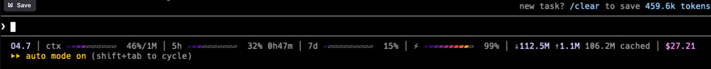

# cc-statusline-magma

A custom statusline for [Claude Code](https://claude.com/claude-code) with a smooth indigo→magenta→orange→yellow gradient progress bar, cache hit-rate tracking, and session token totals.



## What you see

```
Opus 4.7 │ ctx ▰▰▰▰▰▱▱▱▱▱ 46%/1M │ 5h ▰▰▰▱▱▱▱▱▱▱ 32% 0h47m │ 7d ▰▱▱▱▱▱▱▱▱▱ 15% │ ⚡▰▰▰▰▰▰▰▰▰▱ 99% │ ↓112M ↑1.1M 106M cached │ $27.21
```

From left to right:

| Field | What it means |
|---|---|
| `Opus 4.7` | Model display name (abbreviated; `1M`/`200K` context suffix) |
| `ctx 46%/1M` | Context window used % out of total size |
| `5h 32% 0h47m` | 5-hour rate limit used %, with time until reset |
| `7d 15%` | 7-day rate limit used % |
| `⚡ 99%` | Cache hit rate on last turn (high = good = green) |
| `↓112M ↑1.1M 106M cached` | Session cumulative: input tokens / output tokens / cache reads |
| `$27.21` | Total session cost (USD) |

The default "Smooth-Magma" gradient (indigo → magenta → orange → yellow) is applied **by cell position, not by percentage** — so colour stays consistent across metrics and the leading edge shows magnitude. The labels (`ctx` / `5h` / `7d` / `⚡`) carry the good-vs-bad semantic instead.

Empty cells (`▱`) are dimmed so the filled cells pop.

## Themes

Switch palette with the `STATUSLINE_THEME` environment variable:

```bash
export STATUSLINE_THEME=viridis   # ~/.bashrc or ~/.zshrc
```

| Theme | Palette | Vibe |
|---|---|---|
| `magma` *(default)* | dark indigo → magenta → orange → bright yellow | Matplotlib's magma — bold and warm |
| `viridis` | dark purple → blue → teal → green → bright yellow | **Color-blind friendly** ([perceptually uniform](https://bids.github.io/colormap/)) |
| `ocean` | deep navy → bright blue → light cyan → near-white | Cool aquatic |
| `forest` | dark green → grass → pale lime | Warm natural |
| `cyberpunk` | deep purple → magenta → hot pink → cyan → mint | Vapor-wave / neon, saturated chromatic clash |

Unknown theme value silently falls back to `magma`.

> **Accessibility note**: if you (or anyone reading over your shoulder) have red-green colour vision deficiency, prefer **`viridis`** — it stays perceptually uniform across the colour-blind spectrum, which `magma` does not.

## Requirements

- **Claude Code ≥ 2.1.116** (earlier versions don't expose `context_window` / `rate_limits` / `cost` JSON fields)
- **`jq`** — JSON parser (`brew install jq` on macOS; `apt install jq` on Debian/Ubuntu)
- **`bash` ≥ 3.2** (macOS default works; Apple ships 3.2.57)
- **Truecolor terminal** for the gradient — iTerm2, Warp, VS Code terminal, Apple Terminal.app, Alacritty, kitty all work. Old `xterm` without 24-bit support will show the bars un-coloured (text still readable).

## Quick install (one command)

```bash
curl -fsSL https://raw.githubusercontent.com/Boming0002/cc-statusline-magma/main/install.sh | bash
```

The installer:

1. Detects your OS and `jq` availability (offers `brew`/`apt` install if missing)
2. Copies `statusline.sh` → `~/.claude/statusline.sh` and `chmod +x`
3. Merges the `statusLine` block into your `~/.claude/settings.json` (preserves existing keys)

Restart Claude Code (or `/clear`) and the statusline appears at the bottom.

## Manual install

```bash
# 1. Download the script
curl -fsSL -o ~/.claude/statusline.sh \
  https://raw.githubusercontent.com/Boming0002/cc-statusline-magma/main/statusline.sh
chmod +x ~/.claude/statusline.sh

# 2. Add this block to ~/.claude/settings.json (top-level)
```

```json
{
  "statusLine": {
    "type": "command",
    "command": "/Users/YOUR_USERNAME/.claude/statusline.sh",
    "padding": 0
  }
}
```

> Replace `YOUR_USERNAME` with your `$HOME` username. Tilde `~` is not expanded.

## How cache hit rate is computed

The `⚡` field reads your **current session transcript** (`.transcript_path` from CC's status JSON):

```jq
[.[] | select(.message.usage != null) | .message.usage] as $u
| ($u[-1] // {}) as $last
| (($last.cache_read_input_tokens // 0)
   + ($last.cache_creation_input_tokens // 0)
   + ($last.input_tokens // 0)) as $denom
| {
    pct: (if $denom > 0
          then (($last.cache_read_input_tokens // 0) * 100 / $denom | floor)
          else 0 end)
  }
```

i.e. for the **last turn only**: `cache_read / (input + cache_creation + cache_read)`.

Why this matters: cache hit % shows whether prompt caching is actually working for you. Sustained < 50% on a long session usually means cache TTL expired between turns — bumping prompt structure to land cacheable prefix early is the fix.

## Troubleshooting

| Symptom | Likely cause |
|---|---|
| Statusline shows no colour, just `▰▱` characters | Terminal doesn't support truecolor. Try iTerm2/Warp/VS Code/Apple Terminal. |
| All metrics show `0%` | CC version < 2.1.116 — upgrade with `npm install -g @anthropic-ai/claude-code@latest --force` |
| `jq: command not found` | Install `jq` — `brew install jq` (Mac) / `apt install jq` (Linux) |
| Statusline not visible at all | Check `~/.claude/settings.json` has the `statusLine` block; restart CC |
| `⚡` always `0%` | Either no usage data yet (fresh session) or `transcript_path` not exposed in your CC version |

## Why open source?

Built for personal use on a Mac dev workflow. Sharing because:

- Prompt caching is one of the highest-leverage levers when using CC heavily, but most users have no idea what their cache hit rate actually is. **Visibility is the prerequisite for optimisation.**
- The 5h/7d rate limit fields are public CC features but barely surfaced — putting them next to context % helps you pace usage.

## License

[MIT](LICENSE) — do what you want, attribution appreciated.

## Changelog

See [CHANGELOG.md](CHANGELOG.md).
