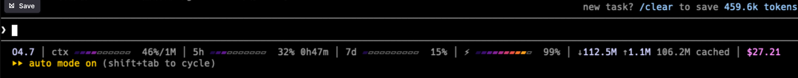

# cc-statusline-magma

A custom statusline for [Claude Code](https://claude.com/claude-code) with a smooth indigo→magenta→orange→yellow gradient progress bar, cache hit-rate tracking, and session token totals.



## What you see

```
O4.7·1M │ ctx ▰▰▰▰▱▱▱▱▱▱  46%/1M │ 5h ▰▰▰▱▱▱▱▱▱▱  32% 0h47m │ 7d ▰▱▱▱▱▱▱▱▱▱  15% │ ⚡▰▰▰▰▰▰▰▰▰▱  99% │ ↓112.0M ↑1.1M 106.0M cached │ $27.21
```

From left to right:

| Field | What it means |
|---|---|
| `O4.7·1M` | Model display name, abbreviated: `Opus`→`O`, `Sonnet`→`S`, `Haiku`→`H`; context suffix `·1M` / `·200K` |
| `ctx 46%/1M` | Context window used % out of total size |
| `5h 32% 0h47m` | 5-hour rate limit used %, with time until reset |
| `7d 15%` | 7-day rate limit used % |
| `⚡ 99%` | Cache hit rate on last turn (high = good = green) |
| `↓112.0M ↑1.1M 106.0M cached` | Session cumulative **(main thread only — subagent/Task turns excluded)**: input / output / cache-read tokens |
| `$27.21` | Total session cost (USD) |

> Percentages are right-aligned to 3 characters (`  7%` / ` 46%` / `100%`) so the columns stay stable as values change. Token counts ≥ 1M always carry one decimal (`106.0M`).

The default "Smooth-Magma" gradient (indigo → magenta → orange → yellow) is applied **by cell position, not by percentage** — so colour stays consistent across metrics and the leading edge shows magnitude. The labels (`ctx` / `5h` / `7d` / `⚡`) carry the good-vs-bad semantic instead.

Empty cells (`▱`) are dimmed so the filled cells pop.

## Themes

Switch palette with the `STATUSLINE_THEME` environment variable:

```bash
export STATUSLINE_THEME=viridis   # ~/.bashrc or ~/.zshrc
```

| Theme | Palette | Vibe |
|---|---|---|
| `magma` *(default)* | dark indigo → magenta → orange → bright yellow | Matplotlib's magma — bold and warm |
| `viridis` | dark purple → blue → teal → green → bright yellow | **Color-blind friendly** ([perceptually uniform](https://bids.github.io/colormap/)) |
| `ocean` | deep navy → bright blue → light cyan → near-white | Cool aquatic |
| `forest` | dark green → grass → pale lime | Warm natural |
| `cyberpunk` | deep purple → magenta → hot pink → cyan → mint | Vapor-wave / neon, saturated chromatic clash |

Unknown theme value silently falls back to `magma`.

> **Accessibility note**: if you (or anyone reading over your shoulder) have red-green colour vision deficiency, prefer **`viridis`** — it stays perceptually uniform across the colour-blind spectrum, which `magma` does not.

## Dark vs Light terminal

Default palette assumes a **dark terminal background**. If your terminal has a light/white background, set:

```bash
export STATUSLINE_BG=light   # ~/.bashrc or ~/.zshrc
```

What changes on light bg:

- **Gradient cells** are capped in brightness — no fade to yellow/white that disappears against white background. Each theme has a hand-tuned light variant.
- **Accent colours** swap: `cyan` model name → `blue`, `magenta` cost → `red`. Higher contrast on white.
- **Dimmed empty cells** unchanged (`\033[2m` works on both backgrounds).

Combine freely with `STATUSLINE_THEME`. Unknown values silently fall back to `magma_dark`.

```bash
# Dark terminal, viridis (default bg=dark)
STATUSLINE_THEME=viridis

# Light terminal, ocean
STATUSLINE_THEME=ocean STATUSLINE_BG=light

# Light terminal, default magma palette tuned for light
STATUSLINE_BG=light
```

## Requirements

- **Claude Code ≥ 2.1.116** (earlier versions don't expose `context_window` / `rate_limits` / `cost` JSON fields)
- **Truecolor terminal** for the gradient — iTerm2, Warp, VS Code terminal, Apple Terminal.app, Alacritty, kitty, Windows Terminal all work. Old terminals without 24-bit support show the bars un-coloured (text still readable).
- Per platform:
  - **macOS / Linux** — the `statusline.sh` (bash) version: needs **`bash` ≥ 3.2** (Apple ships 3.2.57) and **`jq`** (`brew install jq` / `apt install jq`).
  - **Windows** — two supported paths (see [Windows](#windows) below):
    - *With Git Bash* → runs `statusline.sh` (needs `jq`; install via `winget`/`scoop`/`choco`).
    - *Without Git Bash* → runs the `statusline.ps1` (PowerShell) version: **PowerShell 5.1+** (ships with Windows) or PowerShell 7, **no `jq` required**.

## Quick install (one command)

```bash
curl -fsSL https://raw.githubusercontent.com/Boming0002/cc-statusline-magma/main/install.sh | bash
```

The installer:

1. Ensures `jq` is available (offers `brew` / `apt` / `yum` / `dnf` / `apk` / `winget` / `scoop` / `choco` / `pacman` install if missing)
2. Copies `statusline.sh` → `~/.claude/statusline.sh` and `chmod +x`
3. Merges the `statusLine` block into your `~/.claude/settings.json` (preserves existing keys; warns before replacing a different existing status line; keeps one rolling `.bak`)

Restart Claude Code (or `/clear`) and the statusline appears at the bottom.

> **Windows:** this `curl … | bash` path needs Git Bash. No Git Bash? Use the PowerShell installer instead — see [Windows](#windows).

## Manual install

```bash
# 1. Download the script
curl -fsSL -o ~/.claude/statusline.sh \
  https://raw.githubusercontent.com/Boming0002/cc-statusline-magma/main/statusline.sh
chmod +x ~/.claude/statusline.sh

# 2. Add this block to ~/.claude/settings.json (top-level)
```

```json
{
  "statusLine": {
    "type": "command",
    "command": "/Users/YOUR_USERNAME/.claude/statusline.sh",
    "padding": 0
  }
}
```

> Replace `YOUR_USERNAME` with your `$HOME` username. Tilde `~` is not expanded.

## Windows

On Windows, Claude Code runs the status line command **through Git Bash when Git Bash is installed, and through PowerShell when it isn't**. So there are two paths — pick the one matching your setup:

### Path A — you have Git Bash (recommended if installed)

Use the bash version. From Git Bash:

```bash
# one-liner
curl -fsSL https://raw.githubusercontent.com/Boming0002/cc-statusline-magma/main/install.sh | bash
# or, from a clone
./install.sh
```

The installer now finds `jq` via `winget` / `scoop` / `choco` / `pacman` if it's missing, and `statusline.sh` translates the Windows transcript path (via `cygpath`) so the cache/token stats work under Git Bash.

### Path B — no Git Bash (native PowerShell)

Use the PowerShell version (`statusline.ps1`) — **no `jq` needed**, it parses JSON natively.

```powershell
# one-liner (downloads statusline.ps1 + wires up settings.json)
irm https://raw.githubusercontent.com/Boming0002/cc-statusline-magma/main/install.ps1 | iex
# or, from a clone
powershell -ExecutionPolicy Bypass -File .\install.ps1
```

Or wire it up manually — add this to `~/.claude/settings.json` (use **forward slashes**; Git Bash, if CC ever routes through it, eats unquoted backslashes):

```json
{
  "statusLine": {
    "type": "command",
    "command": "powershell -NoProfile -File C:/Users/YOU/.claude/statusline.ps1",
    "padding": 0
  }
}
```

Notes:

- The `~` shorthand works and expands to your Windows home directory; `C:\Users\...` backslash paths fail silently — use `/`.
- Swap `powershell` for `pwsh` if you only have PowerShell 7. Add `-ExecutionPolicy Bypass` if your machine's execution policy blocks the script.
- `statusline.ps1` targets both **Windows PowerShell 5.1** and **PowerShell 7+**, supports the same `STATUSLINE_THEME` / `STATUSLINE_BG` env vars, and renders identically to the bash version.
- If the status line never appears with the PowerShell command even though `statusline.ps1` runs fine by hand, this is a [known CC routing quirk](https://github.com/anthropics/claude-code/issues/30725) when Git Bash is installed — use **Path A** (the bash version) instead.

## Uninstall

Remove the script and the `statusLine` block from your settings:

```bash
# macOS / Linux / Git Bash
rm ~/.claude/statusline.sh
jq 'del(.statusLine)' ~/.claude/settings.json > ~/.claude/settings.tmp && mv ~/.claude/settings.tmp ~/.claude/settings.json
```

```powershell
# Windows PowerShell
Remove-Item ~\.claude\statusline.ps1
$s = Get-Content ~\.claude\settings.json -Raw | ConvertFrom-Json
$s.PSObject.Properties.Remove('statusLine')
[System.IO.File]::WriteAllText("$HOME\.claude\settings.json", ($s | ConvertTo-Json -Depth 100), [System.Text.UTF8Encoding]::new($false))
```

The installer leaves a single `~/.claude/settings.json.bak` (your previous settings) — delete it once you're happy. Restart Claude Code afterwards.

## How cache hit rate is computed

The `⚡` field reads your **current session transcript** (`.transcript_path` from CC's status JSON):

```jq
[.[] | select(.message.usage != null) | .message.usage] as $u
| ($u[-1] // {}) as $last
| (($last.cache_read_input_tokens // 0)
   + ($last.cache_creation_input_tokens // 0)
   + ($last.input_tokens // 0)) as $denom
| {
    pct: (if $denom > 0
          then (($last.cache_read_input_tokens // 0) * 100 / $denom | floor)
          else 0 end)
  }
```

i.e. for the **last turn only**: `cache_read / (input + cache_creation + cache_read)`.

Why this matters: cache hit % shows whether prompt caching is actually working for you. Sustained < 50% on a long session usually means cache TTL expired between turns — bumping prompt structure to land cacheable prefix early is the fix.

## Troubleshooting

| Symptom | Likely cause |
|---|---|
| Statusline shows no colour, just `▰▱` characters | Terminal doesn't support truecolor. Try iTerm2/Warp/VS Code/Apple Terminal/Windows Terminal. |
| All metrics show `0%` | CC version < 2.1.116 — upgrade with `npm install -g @anthropic-ai/claude-code@latest --force` |
| `jq: command not found` | Install `jq` — `brew install jq` (Mac) / `apt install jq` (Linux) / `winget install jqlang.jq` (Windows). Or use the PowerShell version, which needs no `jq`. |
| Statusline not visible at all | Check `~/.claude/settings.json` has the `statusLine` block; restart CC |
| `⚡` always `0%` | Either no usage data yet (fresh session) or `transcript_path` not exposed in your CC version |
| **(Windows)** PowerShell status line runs by hand but never shows in CC | Known CC routing quirk when Git Bash is installed ([#30725](https://github.com/anthropics/claude-code/issues/30725)) — use the bash version via Git Bash ([Path A](#path-a--you-have-git-bash-recommended-if-installed)). |
| **(Windows)** `running scripts is disabled on this system` | Execution policy blocks the script — use `powershell -ExecutionPolicy Bypass -File …` in the command. |
| **(Windows)** Bars render as boxes/`▯` (tofu) | Terminal font lacks the `▰`/`▱` glyphs — use a font with Geometric Shapes coverage (e.g. Cascadia Mono, DejaVu Sans Mono) in Windows Terminal. |

## Why open source?

Built for personal use on a Mac dev workflow. Sharing because:

- Prompt caching is one of the highest-leverage levers when using CC heavily, but most users have no idea what their cache hit rate actually is. **Visibility is the prerequisite for optimisation.**
- The 5h/7d rate limit fields are public CC features but barely surfaced — putting them next to context % helps you pace usage.

## License

[MIT](LICENSE) — do what you want, attribution appreciated.

## Changelog

See [CHANGELOG.md](CHANGELOG.md).
